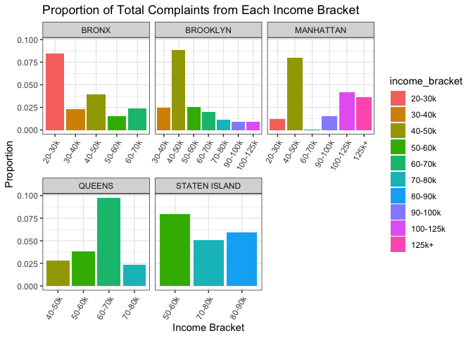
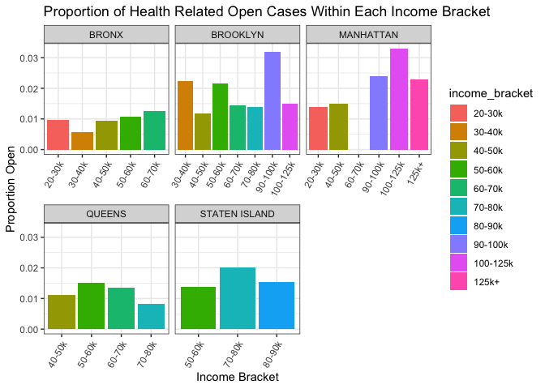
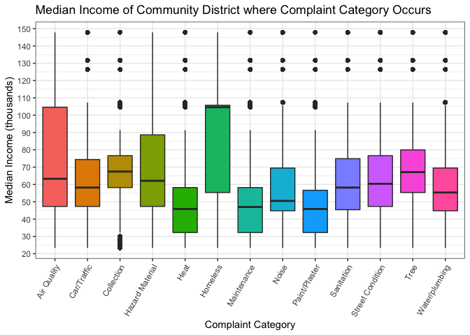
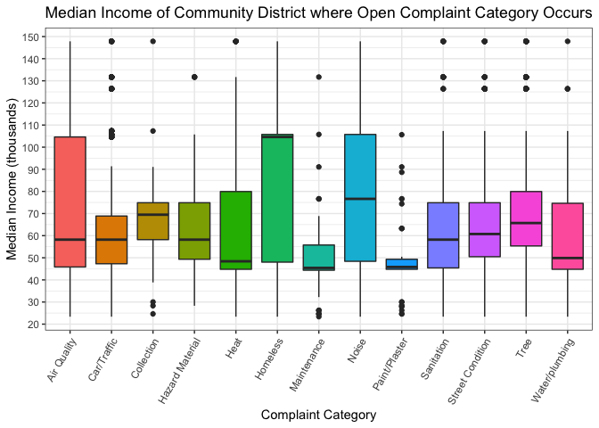
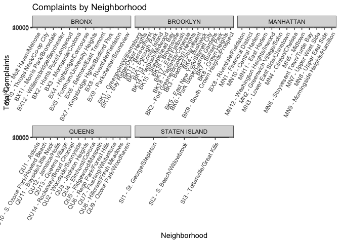
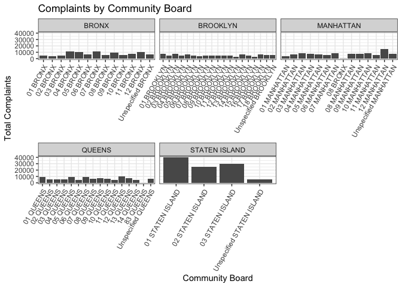
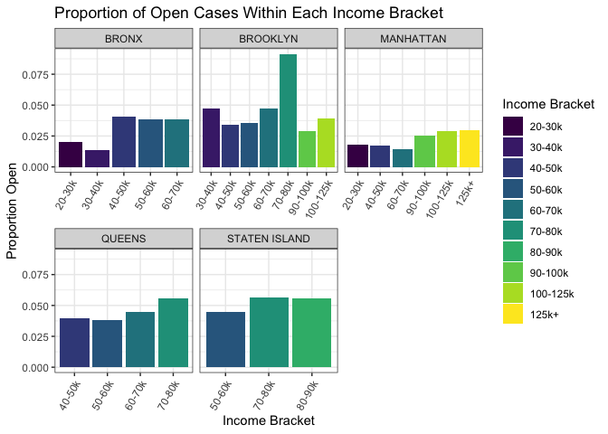
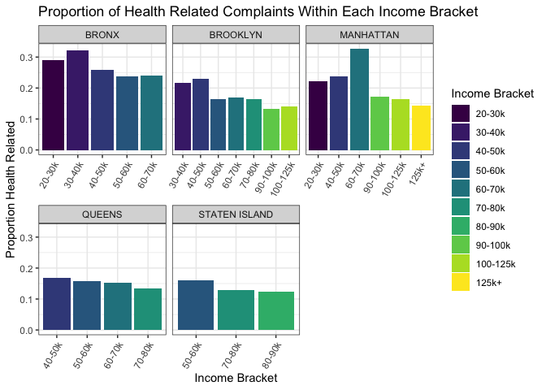
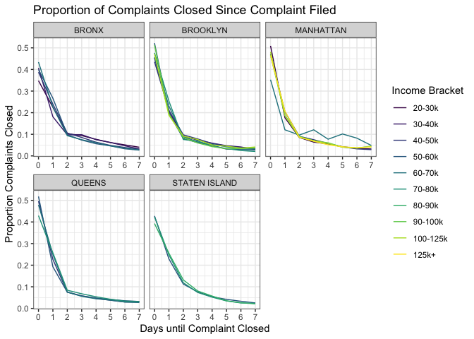

Descriptive stats plots
================
Molly Martorella
12/3/2019

# Data

## NYC 311

Load and tidy the data. Data is 100k randomly sampled complaints from
all neighborhoods across all NYC boroughs (600k total samples). Years
sampled were 2014-2018.

Data downloaded from:
<https://wetransfer.com/downloads/f8c5d6c17483e279ff56018db9c44cc420191201000026/c5f48b>

``` r
nyc <- read_csv(file = "./p8105nyc_311_100k.csv") %>% 
    janitor::clean_names()
```

    ## Parsed with column specification:
    ## cols(
    ##   .default = col_character(),
    ##   unique_key = col_double(),
    ##   created_year = col_double(),
    ##   created_time = col_time(format = ""),
    ##   incident_zip = col_double(),
    ##   landmark = col_logical(),
    ##   bbl = col_double(),
    ##   x_coordinate_state_plane = col_double(),
    ##   y_coordinate_state_plane = col_double(),
    ##   vehicle_type = col_logical(),
    ##   taxi_company_borough = col_logical(),
    ##   taxi_pick_up_location = col_logical(),
    ##   bridge_highway_name = col_logical(),
    ##   bridge_highway_direction = col_logical(),
    ##   road_ramp = col_logical(),
    ##   bridge_highway_segment = col_logical(),
    ##   latitude = col_double(),
    ##   longitude = col_double()
    ## )

    ## See spec(...) for full column specifications.

``` r
nyc_tidy <- nyc %>% 
    filter(borough != "Unspecified") %>% 
    separate(closed_date, 
             into = c("closed_month","closed_day","closed_year"), 
             sep = "\\/" ) %>%
    separate(closed_year, 
             into = c("closed_year","closed_time"), 
             sep = " ") %>% 
    mutate(
        created_year = as.numeric(created_year),
        created_month = as.numeric(created_month),
        created_day = as.numeric(created_day),
        city = as.factor(city),
        status = as.factor(status),
        borough = as.factor(borough),
        agency = as.factor(agency),
        complaint_type = as.factor(complaint_type),
        community_board = as.factor(community_board),
       open_complaint = ifelse(status == "Closed", yes = 0, no = 1),
      # open_complaint = ifelse(is.na(closed_year),  yes = 1, no = 0),
        complaint_simp = case_when(
            str_detect(complaint_type, 
                       regex("street", ignore_case = TRUE))
            |str_detect(complaint_type, 
                        regex("sidewalk", ignore_case = TRUE))
            |str_detect(complaint_type, 
                        regex("curb", ignore_case = TRUE)) ~ "Street Condition",
            str_detect(complaint_type, 
                       regex("noise", ignore_case = TRUE)) ~ "Noise",
            str_detect(complaint_type, 
                       regex("heat", ignore_case = TRUE)) ~ "Heat",
            str_detect(complaint_type, 
                       regex("water", ignore_case = TRUE))
            |str_detect(complaint_type, 
                        regex("leak", ignore_case = TRUE))
            |str_detect(complaint_type, 
                        regex("plumbing", ignore_case = TRUE))
            |str_detect(complaint_type, 
                        regex("boiler", ignore_case = TRUE)) ~ "Water/plumbing",
            str_detect(complaint_type, 
                       regex("paint", ignore_case = TRUE)) ~ "Paint/Plaster",
            str_detect(complaint_type, 
                       regex("asbestos", ignore_case = TRUE))
            |str_detect(complaint_type, 
                        regex("lead", ignore_case = TRUE))
            |str_detect(complaint_type, 
                        regex("hazard", ignore_case = TRUE))
            |str_detect(complaint_type, 
                        regex("mold", ignore_case = TRUE)) ~ "Hazard Material",
            str_detect(complaint_type, 
                       regex("elevator", ignore_case = TRUE)) 
            |str_detect(complaint_type, 
                        regex("maintenance", ignore_case = TRUE))
            |str_detect(complaint_type, 
                        regex("electric", ignore_case = TRUE))
            |str_detect(complaint_type, 
                        regex("stairs", ignore_case = TRUE))
            |str_detect(complaint_type, 
                        regex("window", ignore_case = TRUE)) 
            |str_detect(complaint_type, 
                        regex("appliance", ignore_case = TRUE)) ~ "Maintenance",
            str_detect(complaint_type, 
                       regex("sanita", ignore_case = TRUE))
            |str_detect(complaint_type, 
                        regex("rodent", ignore_case = TRUE))
            |str_detect(complaint_type, 
                        regex("dirty", ignore_case = TRUE))
            |str_detect(complaint_type, 
                        regex("sew", ignore_case = TRUE))
            |str_detect(complaint_type, 
                        regex("standing water", ignore_case = TRUE)) ~ "Sanitation",
            str_detect(complaint_type, 
                       regex("tree", ignore_case = TRUE)) ~ "Tree",
            str_detect(complaint_type, 
                       regex("parking", ignore_case = TRUE))
            |str_detect(complaint_type, 
                        regex("car", ignore_case = TRUE))
            |str_detect(complaint_type, 
                        regex("drive", ignore_case = TRUE))
            |str_detect(complaint_type,  
                        regex("vehicle", ignore_case = TRUE))
            |str_detect(complaint_type,  
                        regex("traffic", ignore_case = TRUE)) ~ "Car/Traffic",
            str_detect(complaint_type, 
                       regex("air", ignore_case = TRUE)) ~ "Air Quality",
            str_detect(complaint_type, 
                       regex("collection", ignore_case = TRUE)) ~ "Collection",
            str_detect(complaint_type, 
                       regex("homeless", ignore_case = TRUE))
            |str_detect(complaint_type, 
                        regex("panhandling", ignore_case = TRUE)) ~ "Homeless"),
        health_complaint = ifelse(
            complaint_simp %in% c("Heat", "Water/Plumbing", "Hazard Material", "Sanitation", "Air Quality"), yes = 1, no = 0),
        complaint_simp = as.factor(complaint_simp),
        open_health_complaint = case_when(
            open_complaint == 1 & health_complaint == 1 ~ 1,
            open_complaint == 0 | health_complaint == 0 ~ 0
        ),
       # openCorr = ifelse(status == "Closed", yes = 0, no = 1),
        status = as.factor(status)
    )
```

Used skimr::skim, colnames, and levels(factor(nyc$complaint\_type)) to
investigate and tidy the data. New variables were created to establish a
binary status for closed (0) or open (1) complaints.

Key variables include: `year`, `borough`, `community_board`,
`complaint_type`, and `status`.

Newly added variables include:

1.  `complaint_simp` - based on key words, condenses complaint types
    into the following categories: Air Quality, Car/Traffic, Collection,
    Hazard Material, Heat, Homeless, Maintenance, Noise, Paint/Plaster,
    Sanitation, Street Condition, Tree, and Water/plumbing.

2.  `health_complaint` - binary yes (1) or no (0), based on health
    associated categories within `complaint_simp`.

3.  `open_health_complaint` - binary categorization, either health
    complaint that is open (1), or non-health related complaint or
    closed health complaint (0).

4.  `open_complaint` - binary categorization, closed `status` (0), open
    (1)

## Income and population characteristics data:

The variable, `community_board`, will be used to left join NYC 311 data
with income and population characteristics data sourced from American
Community Survey by Community District.

``` r
inc_df = read_csv("./Med_income_2017.csv") %>% 
    janitor::clean_names() %>% 
    mutate(
        inc_1000s = round(median_income/1000, 1),
        income_bracket = case_when(
            median_income >= 20000 & median_income <= 30000 ~ "20-30k",
            median_income > 30000 & median_income <= 40000 ~ "30-40k",
            median_income > 40000 & median_income <= 50000 ~ "40-50k",
            median_income > 50000 & median_income <= 60000 ~ "50-60k",
            median_income > 60000 & median_income <= 70000 ~ "60-70k",
            median_income > 70000 & median_income <= 80000 ~ "70-80k",
            median_income > 80000 & median_income <= 90000 ~ "80-90k",
            median_income > 90000 & median_income <= 100000 ~ "90-100k",
            median_income > 100000 & median_income <= 125000 ~ "100-125k",
            median_income > 125000 & median_income <= 150000 ~ "125k+",
        ),
        income_bracket = as.factor(income_bracket),
        income_bracket = fct_relevel(income_bracket, c("20-30k", "30-40k", "40-50k", "50-60k", "60-70k", "70-80k", "80-90k", "90-100k", "100-125k", "125k+"))
    )
```

    ## Parsed with column specification:
    ## cols(
    ##   MapID = col_double(),
    ##   `Area Name` = col_character(),
    ##   Median_Income = col_double(),
    ##   community_board = col_character(),
    ##   per_blackNH = col_double(),
    ##   per_whiteNH = col_double(),
    ##   per_hisp = col_double(),
    ##   per_other = col_double(),
    ##   `Total Population` = col_double()
    ## )

``` r
nyc_inc = left_join(nyc_tidy, inc_df, by = "community_board")
```

    ## Warning: Column `community_board` joining factor and character vector, coercing
    ## into character vector

`income_bracket` and `inc_1000s` (rounds income and divides by 1000)
variables were added to the neighborhood population characteristics data
to ease downstream plots and analyses. The data were left joined using
the `community_board` variable.

## Combined and tidied data for plotting

``` r
nyc_plots <- nyc_inc %>% 
    group_by(area_name, created_year) %>%
    add_count(area_name, name = "number_complaints") %>% 
    mutate(
        num_unsolved = sum(open_complaint),
        num_health_complaint = sum(health_complaint),
        num_open_health = sum(open_health_complaint)
    ) %>% 
    select(-unique_key, -city, -park_borough, -agency, -agency_name, -descriptor, -incident_zip, -incident_address, -street_name, -cross_street_1, -cross_street_2, -intersection_street_1, -intersection_street_2, -landmark, -facility_type, -resolution_description, -resolution_action_updated_date, -bbl, -x_coordinate_state_plane, -y_coordinate_state_plane, -open_data_channel_type, -park_facility_name, -vehicle_type, -taxi_company_borough, -taxi_pick_up_location, -bridge_highway_name, -bridge_highway_direction, -bridge_highway_segment, -latitude, -longitude, -location, -road_ramp, -location_type, -address_type, -map_id)


# for days to close calculation:

nyc_plots %>%
    filter(status == "Closed") %>% 
    mutate(closed_year = as.numeric(closed_year),
        closed_month = as.numeric(closed_month),
        closed_day = as.numeric(closed_day)) %>% 
    filter(closed_year != 2047) %>% 
    mutate(diff_year = abs(closed_year - created_year),
        diff_month = abs(closed_month - created_month),
        diff_day = abs(closed_day - created_day),
        diff_dayt = abs(diff_year*365 + diff_month*30 + diff_day))
```

    ## # A tibble: 479,689 x 34
    ## # Groups:   area_name, created_year [300]
    ##    created_month created_day created_year created_time closed_month closed_day
    ##            <dbl>       <dbl>        <dbl> <time>              <dbl>      <dbl>
    ##  1             6          18         2016 06:42:00                6         23
    ##  2            10          18         2017 04:15:02               10         18
    ##  3            11           7         2018 07:39:00               11          9
    ##  4            10           3         2015 11:28:42               10         20
    ##  5            11          27         2015 10:58:11               11         27
    ##  6             4          10         2014 12:00:00                4         25
    ##  7             8          30         2016 11:06:20                9         15
    ##  8            11           1         2014 02:41:40               11          1
    ##  9             3           8         2016 10:06:05                3          8
    ## 10             5          14         2016 08:36:23                5         14
    ## # … with 479,679 more rows, and 28 more variables: closed_year <dbl>,
    ## #   closed_time <chr>, complaint_type <fct>, status <fct>, due_date <chr>,
    ## #   community_board <chr>, borough <fct>, open_complaint <dbl>,
    ## #   complaint_simp <fct>, health_complaint <dbl>, open_health_complaint <dbl>,
    ## #   area_name <chr>, median_income <dbl>, per_black_nh <dbl>,
    ## #   per_white_nh <dbl>, per_hisp <dbl>, per_other <dbl>,
    ## #   total_population <dbl>, inc_1000s <dbl>, income_bracket <fct>,
    ## #   number_complaints <int>, num_unsolved <dbl>, num_health_complaint <dbl>,
    ## #   num_open_health <dbl>, diff_year <dbl>, diff_month <dbl>, diff_day <dbl>,
    ## #   diff_dayt <dbl>

The newly combined dataframe was grouped according to `area_name`, a key
variable from the population characteristics dataset that provides the
local neighborhood name within the borough. Extraneous variables were
removed to reduce the dataframe size and ease manipulation of the data.

Newly added variables include:

1.  `number_complaints` - total number of complaints within the given
    neighborhood the complaint was filed.

2.  `num_unsolved` - total number of open/unresolved complaints within
    the neighborhood the complaint was filed.

3.  `num_health_complaint` - total number of health related complaints
    within the neighborhood the complaint was filed.

4.  `num_open_health` - total number of open/unresolved health
    complaints within the neighborhood the complaint was filed.

# Plots

#### Total number of complaints by income bracket

``` r
# nyc_plots %>% 
#     filter(!is.na(income_bracket)) %>% 
#     group_by(income_bracket) %>% 
#     summarize(n = n(),
#               proportion = n/nrow(nyc_plots)) %>% 
#     ggplot(aes(x = income_bracket, y = proportion)) +
#     geom_col() +
#     ylab("Proportion of Total Complaints") +
#     ggtitle("Relative Number of Complaints Filed from Each Income Bracket")

nyc_plots %>% 
    filter(!is.na(income_bracket)) %>% 
    group_by(income_bracket, borough) %>% 
    summarize(n = n(),
              proportion = n/nrow(nyc_plots)) %>% 
    ggplot(aes(x = income_bracket, y = proportion, fill = income_bracket)) +
    geom_col() +
    ylab("Proportion") +
    xlab("Income Bracket") +
    ggtitle("Proportion of Total Complaints from Each Income Bracket") +
    facet_wrap(~borough, scales = "free_x") +
    theme(axis.text.x = element_text(angle = 60, hjust = 1))
```

<!-- -->

Middle class income groups proportionally file the most complaints
across all income brackets. The only exception is the Bronx, in which
the proportion of 311 complaints is higher in the lowest income group.

#### Proportion of unsolved cases by income bracket

Proportion open:

``` r
p <- nyc_plots %>% 
    filter(!is.na(income_bracket)) %>% 
    group_by(income_bracket, borough, open_complaint) %>% 
    summarize(n = n()) %>% 
    pivot_wider(names_from = open_complaint, values_from = n) %>% 
    rename(closed = '0',
           open = '1')

p %>% mutate(proportion = (open/closed)) %>% 
    ggplot(aes(x = income_bracket, y = proportion, fill = income_bracket)) +
    geom_col() +
    facet_wrap(~borough, scales = "free_x") +
    ggtitle("Proportion of Open Cases Within Each Income Bracket") +
    xlab("Income Bracket") +
    ylab("Proportion Open") +
    theme(axis.text.x = element_text(angle = 60, hjust = 1))
```

<!-- -->

#### Total Health related complaints broken down by income bracket

``` r
nyc_plots %>% 
    filter(!is.na(income_bracket)) %>% 
    group_by(income_bracket, borough, health_complaint) %>% 
    summarize(n = n(),
              proportion = n/nrow(nyc_plots)) %>% 
    ggplot(aes(x = income_bracket, y = proportion, fill = income_bracket)) +
    geom_col() +
    ylab("Proportion") +
    xlab("Income Bracket") +
    ggtitle("Proportion of Total Complaints from Each Income Bracket") +
    facet_wrap(~borough, scales = "free_x") +
    theme(axis.text.x = element_text(angle = 60, hjust = 1))
```

<!-- -->

#### Proportion Health related complaints open broken down by income bracket:

``` r
h <- nyc_plots %>% 
    filter(!is.na(income_bracket),
           health_complaint == 1) %>% 
    group_by(income_bracket, borough, open_complaint) %>% 
    summarize(n = n()) %>% 
    pivot_wider(names_from = open_complaint, values_from = n) %>% 
    rename(closed = '0',
           open = '1')

h %>% mutate(proportion = (open/closed)) %>% 
    ggplot(aes(x = income_bracket, y = proportion, fill = income_bracket)) +
    geom_col() +
    facet_wrap(~borough, scales = "free_x") +
    ggtitle("Proportion of Health Related Open Cases Within Each Income Bracket") +
    xlab("Income Bracket") +
    ylab("Proportion Open") +
    theme(axis.text.x = element_text(angle = 60, hjust = 1))
```

    ## Warning: Removed 1 rows containing missing values (position_stack).

<!-- -->

#### Median income of each complaint category:

``` r
nyc_plots %>% 
    filter(!is.na(median_income),
           !is.na(complaint_simp)) %>% 
    mutate(complaint_simp = fct_reorder(complaint_simp, median_income)) %>% 
    ggplot(aes(x = complaint_simp, 
               y = (median_income/1000), 
               fill = complaint_simp)) +
    geom_boxplot() +
    theme(axis.text.x = element_text(angle = 60, hjust = 1),
          legend.position = "none") +
    scale_y_continuous(breaks = scales::pretty_breaks(n = 10)) +
    ylab("Median Income (thousands)") +
    xlab("Complaint Category") +
    ggtitle("Median Income of Community District where Complaint Category Occurs")
```

<!-- -->

``` r
# open cases:

nyc_plots %>% 
    filter(!is.na(median_income),
           !is.na(complaint_simp),
           open_complaint == 1) %>% 
    ggplot(aes(x = complaint_simp, 
               y = (median_income/1000), 
               fill = complaint_simp)) +
    geom_boxplot() +
    theme(axis.text.x = element_text(angle = 60, hjust = 1),
          legend.position = "none") +
    scale_y_continuous(breaks = scales::pretty_breaks(n = 10)) +
    ylab("Median Income (thousands)") +
    xlab("Complaint Category") +
    ggtitle("Median Income of Community District where Open Complaint Category Occurs")
```

<!-- -->

#### Not to be included:

Total complaints within each neighborhood of each borough:

``` r
nyc_plots %>% 
    filter(!is.na(area_name)) %>% 
    group_by(area_name, borough) %>% 
    summarize(n = n()) %>% 
    ggplot(aes(x = area_name, y = n)) +
    geom_col() +
    ylab("Total Complaints") +
    xlab("Neighborhood") +
    theme(axis.text.x = element_text(angle = 60, hjust = 1)) +
    ggtitle("Complaints by Neighborhood") +
    facet_wrap(~borough, scales = "free_x")
```

<!-- -->

``` r
nyc_plots %>% 
    filter(!is.na(community_board)) %>% 
    group_by(community_board, borough) %>% 
    summarize(n = n()) %>% 
    filter(n > 100) %>% 
    ggplot(aes(x = community_board, y = n)) +
    geom_col() +
    ylab("Total Complaints") +
    xlab("Community Board") +
    theme(axis.text.x = element_text(angle = 60, hjust = 1)) +
    ggtitle("Complaints by Community Board") +
    facet_wrap(~borough, scales = "free_x")
```

<!-- -->

other med income plot:

``` r
# 
# nyc_plots %>% 
#     filter(!is.na(income_bracket),
#            !is.na(complaint_simp)) %>% 
#     group_by(income_bracket, borough, complaint_simp) %>% 
#     summarize(n = n()) %>% 
#     mutate(proportion = n/nrow(nyc_plots)) %>% 
#     arrange(income_bracket, proportion) %>% 
#     mutate(order = row_number()) %>% 
#     group_by(complaint_simp) %>% 
#     ggplot(aes(x = complaint_simp, y = proportion, fill = complaint_simp)) +
#     geom_col() +
#     facet_wrap(~income_bracket, scales = "free_x", ncol = 5) +
#     theme(axis.text.x = element_text(angle = 75, hjust = 1))
# 

# 
#            complaint_simp = fct_reorder(complaint_simp, 
#                                         proportion, 
#                                         .desc = TRUE)) %>% 
```

density plot of number of days to close by income group or pop
proportions?

``` r
nyc_plots %>%
    filter(status == "Closed") %>% 
    mutate(closed_year = as.numeric(closed_year),
        closed_month = as.numeric(closed_month),
        closed_day = as.numeric(closed_day)) %>% 
    filter(closed_year != 2047) %>% 
    mutate(diff_year = abs(closed_year - created_year),
        diff_month = abs(closed_month - created_month),
        diff_day = abs(closed_day - created_day),
        diff_dayt = abs(diff_year*365 + diff_month*30 + diff_day)) %>% 
    select(income_bracket,
           median_income,
           borough, 
           diff_dayt,
           diff_year,
           diff_month,
           diff_day) %>% 
    filter(diff_dayt < 10,
           !is.na(income_bracket)) %>% 
    group_by(borough, income_bracket, diff_dayt) %>% 
    summarize(n = n()) %>% 
    ggplot(aes(x = diff_dayt, y = n, group = income_bracket, color = income_bracket)) + 
    geom_line() +
    facet_wrap(~borough)
```

    ## Adding missing grouping variables: `area_name`, `created_year`

<!-- -->

``` r
# sum total of income by borough
# 
# nyc_plots %>%
#     filter(status == "Closed") %>% 
#     mutate(closed_year = as.numeric(closed_year),
#         closed_month = as.numeric(closed_month),
#         closed_day = as.numeric(closed_day)) %>% 
#     filter(closed_year != 2047) %>% 
#     mutate(diff_year = abs(closed_year - created_year),
#         diff_month = abs(closed_month - created_month),
#         diff_day = abs(closed_day - created_day),
#         diff_dayt = abs(diff_year*365 + diff_month*30 + diff_day)) %>% 
#     select(per_black_nh:per_other,
#            area_name,
#            created_year,
#            borough, 
#            diff_dayt) %>% 
#     filter(diff_dayt < 10) %>%
#     pivot_longer(cols = per_black_nh:per_other, names_to = "race", values_to = "percent_pop") %>% 
#     filter(!is.na(race),
#            !is.na(percent_pop),
#            !is.na(diff_dayt)) %>%
#     ggplot(aes(x = race, y = diff_dayt, color = race)) +
#     geom_boxplot()
# 
#     
# d <- nyc_plots %>% 
#     filter(status == "Closed") %>% 
#     mutate(closed_year = as.numeric(closed_year),
#         closed_month = as.numeric(closed_month),
#         closed_day = as.numeric(closed_day)) %>% 
#     filter(closed_year != 2047) %>% 
#     mutate(diff_year = abs(closed_year - created_year),
#         diff_month = abs(closed_month - created_month),
#         diff_day = abs(closed_day - created_day),
#         diff_dayt = abs(diff_year*365 + diff_month*30 + diff_day)) %>% 
#     select(per_black_nh:per_other, diff_dayt, borough, area_name, created_year) %>% 
#     pivot_longer(cols = per_black_nh:per_other, names_to = "race", values_to = "percent_pop") %>% 
#     filter(!is.na(race),
#            !is.na(percent_pop),
#            !is.na(diff_dayt)) %>% 
#     group_by(race, borough, percent_pop, diff_dayt) %>% 
#     summarize(n = n())
#     
# 
# d %>% ggplot(aes(x = percent_pop, y = diff_dayt, group = race, color = race)) +
#     geom_line() +
#     facet_wrap(~borough)
```

# Final Plots:

## Proportion of unsolved cases by income bracket

``` r
p <- nyc_plots %>% 
    filter(!is.na(income_bracket)) %>% 
    group_by(income_bracket, borough, open_complaint) %>% 
    summarize(n = n()) %>% 
    pivot_wider(names_from = open_complaint, values_from = n) %>% 
    rename(closed = '0',
           open = '1')

p %>% mutate(proportion = (open/(open + closed))) %>% 
    ggplot(aes(x = income_bracket, y = proportion, fill = income_bracket)) +
    geom_col() +
    facet_wrap(~borough, scales = "free_x") +
    ggtitle("Proportion of Open Cases Within Each Income Bracket") +
    xlab("Income Bracket") +
    ylab("Proportion Open") +
    theme(axis.text.x = element_text(angle = 60, hjust = 1)) +
    scale_fill_viridis(discrete = TRUE) +
    labs(fill = "Income Bracket")
```

<!-- -->

## Proportion of health related complaints by each income category:

``` r
h <- nyc_plots %>% 
    filter(!is.na(income_bracket)) %>% 
    group_by(income_bracket, borough, health_complaint) %>% 
    summarize(n = n()) %>% 
    pivot_wider(names_from = health_complaint, values_from = n) %>% 
    rename(other = '0',
           health_related = '1')

h %>% mutate(proportion = (health_related/(health_related + other))) %>% 
    ggplot(aes(x = income_bracket, y = proportion, fill = income_bracket)) +
    geom_col() +
    facet_wrap(~borough, scales = "free_x") +
    ggtitle("Proportion of Health Related Complaints Within Each Income Bracket") +
    xlab("Income Bracket") +
    ylab("Proportion Health Related") +
    labs(fill = "Income Bracket") +
    theme(axis.text.x = element_text(angle = 60, hjust = 1)) +
    scale_fill_viridis(discrete = TRUE)
```

<!-- -->

## Median income of each complaint category:

``` r
nyc_plots %>% 
    filter(!is.na(median_income),
           !is.na(complaint_simp)) %>% 
    # mutate(complaint_simp = fct_reorder(complaint_simp, median_income)) %>%
    ggplot(aes(x = complaint_simp, 
               y = (median_income/1000), 
               fill = complaint_simp)) +
    geom_boxplot() +
    theme(axis.text.x = element_text(angle = 60, hjust = 1),
          legend.position = "none") +
    scale_y_continuous(breaks = scales::pretty_breaks(n = 10)) +
    ylab("Median Income (thousands)") +
    xlab("Complaint Category") +
    ggtitle("Median Income of Community District where Complaint Category Occurs") +
    scale_fill_viridis(discrete = TRUE)
```

<!-- -->

## plot of percent race plotted against proportion open:

``` r
r <- nyc_plots %>% 
    pivot_longer(cols = per_black_nh:per_other, names_to = "race", values_to = "percent_pop") %>% 
    filter(!is.na(race),
           !is.na(percent_pop)) %>% 
    group_by(race, borough, percent_pop, open_complaint) %>% 
    summarize(n = n()) %>% 
    pivot_wider(names_from = open_complaint, values_from = n) %>% 
    rename(closed = '0',
           open = '1')

r %>% mutate(proportion = (open/(open + closed))) %>% 
    ggplot(aes(x = percent_pop, y = proportion, color = race)) +
    geom_point() +
    geom_smooth(se = FALSE) +
    xlab("Percentage of Community District Population") +
    ylab("Proportion Open") +
    ggtitle("Unresolved Complaints as a Function of Neighborhood Population") +
    scale_color_viridis(name = "Race", labels = c("Black", "Hispanic", "Other", "White"), discrete = TRUE)
```

    ## `geom_smooth()` using method = 'loess' and formula 'y ~ x'

<!-- -->

## days to close given income level

``` r
d <- nyc_plots %>%
    filter(status == "Closed") %>% 
    mutate(closed_year = as.numeric(closed_year),
        closed_month = as.numeric(closed_month),
        closed_day = as.numeric(closed_day)) %>% 
    filter(closed_year != 2047) %>% 
    mutate(diff_year = abs(closed_year - created_year),
        diff_month = abs(closed_month - created_month),
        diff_day = abs(closed_day - created_day),
        diff_dayt = abs(diff_year*365 + diff_month*30 + diff_day)) %>% 
    select(income_bracket,
           median_income,
           borough, 
           diff_dayt,
           diff_year,
           diff_month,
           diff_day) %>% 
    filter(diff_dayt <= 7,
           !is.na(income_bracket)) %>% 
    group_by(borough, income_bracket, diff_dayt) %>% 
    summarize(n = n()) %>% 
    pivot_wider(names_from = diff_dayt, values_from = n) %>% 
    rename(day0 = `0`,
           day1 = `1`,
           day2 = `2`,
           day3 = `3`,
           day4 = `4`,
           day5 = `5`,
           day6 = `6`,
           day7 = `7`)
```

    ## Adding missing grouping variables: `area_name`, `created_year`

``` r
d$total <- d %>% 
    ungroup() %>% 
    select(starts_with("day")) %>% 
    rowSums(.)

d %>% 
    pivot_longer(cols = day0:day7, names_to = "day", values_to = "day_total") %>% 
    mutate(day = recode(day, day0 = 0, day1 = 1, day2 = 2, day3 = 3, day4 = 4, day5 = 5, day6 = 6, day7 = 7),
           proportion = day_total/total) %>% 
    ggplot(aes(x = day, y = proportion, group = income_bracket, color = income_bracket)) + 
    geom_line() +
    facet_wrap(~borough, scales = "free_x") +
    scale_x_continuous(breaks = scales::pretty_breaks(n = 7)) +
    scale_color_viridis(discrete = TRUE) +
    xlab("Days until Complaint Closed") +
    ylab("Proportion Complaints Closed") +
    ggtitle("Proportion of Complaints Closed Since Complaint Filed") +
    labs(color = "Income Bracket")
```

<!-- -->

not sure if the above plot is more informative, alternative plot:

``` r
nyc_plots %>%
    filter(status == "Closed") %>% 
    mutate(closed_year = as.numeric(closed_year),
        closed_month = as.numeric(closed_month),
        closed_day = as.numeric(closed_day)) %>% 
    filter(closed_year != 2047) %>% 
    mutate(diff_year = abs(closed_year - created_year),
        diff_month = abs(closed_month - created_month),
        diff_day = abs(closed_day - created_day),
        diff_dayt = abs(diff_year*365 + diff_month*30 + diff_day)) %>% 
    select(income_bracket,
           median_income,
           borough, 
           diff_dayt,
           diff_year,
           diff_month,
           diff_day) %>% 
    filter(diff_dayt <= 7,
           !is.na(income_bracket)) %>% 
    group_by(borough, income_bracket, diff_dayt) %>% 
    summarize(n = n()) %>% 
    ggplot(aes(x = diff_dayt, y = n, group = income_bracket, color = income_bracket)) + 
    geom_line() +
    facet_wrap(~borough, scales = "free_x") +
    scale_x_continuous(breaks = scales::pretty_breaks(n = 7)) +
    scale_color_viridis(discrete = TRUE) +
    xlab("Days until Complaint Closed") +
    ylab("Total Complaints Closed") +
    ggtitle("Number of Complaints Closed Since Complaint Filed") +
    labs(color = "Income Bracket")
```

    ## Adding missing grouping variables: `area_name`, `created_year`

<!-- -->
