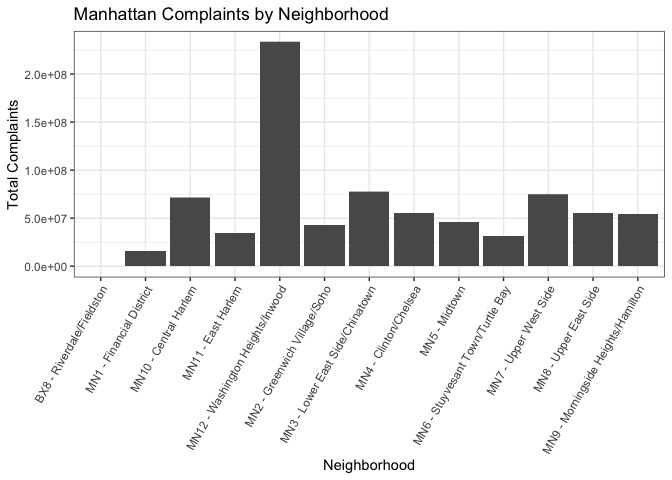
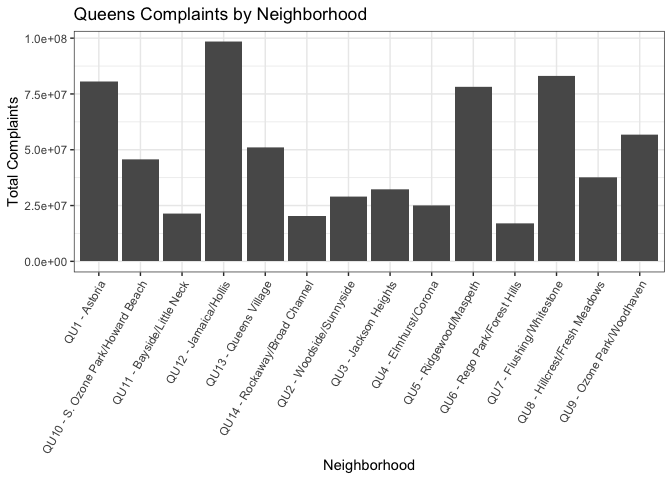

Descriptive stats plots
================
Molly Martorella
12/3/2019

# Data

## NYC 311

Load and tidy the data. Data is 100k randomly sampled complaints from
all neighborhoods across all NYC boroughs (600k total samples). Years
sampled were 2014-2018.

Data downloaded from:
<https://wetransfer.com/downloads/f8c5d6c17483e279ff56018db9c44cc420191201000026/c5f48b>

``` r
nyc <- read_csv(file = "./p8105nyc_311_100k.csv") %>% 
    janitor::clean_names()
```

    ## Parsed with column specification:
    ## cols(
    ##   .default = col_character(),
    ##   unique_key = col_double(),
    ##   created_year = col_double(),
    ##   created_time = col_time(format = ""),
    ##   incident_zip = col_double(),
    ##   landmark = col_logical(),
    ##   bbl = col_double(),
    ##   x_coordinate_state_plane = col_double(),
    ##   y_coordinate_state_plane = col_double(),
    ##   vehicle_type = col_logical(),
    ##   taxi_company_borough = col_logical(),
    ##   taxi_pick_up_location = col_logical(),
    ##   bridge_highway_name = col_logical(),
    ##   bridge_highway_direction = col_logical(),
    ##   road_ramp = col_logical(),
    ##   bridge_highway_segment = col_logical(),
    ##   latitude = col_double(),
    ##   longitude = col_double()
    ## )

    ## See spec(...) for full column specifications.

``` r
nyc_tidy <- nyc %>% 
    filter(borough != "Unspecified") %>% 
    separate(closed_date, 
             into = c("closed_month","closed_day","closed_year"), 
             sep = "\\/" ) %>%
    separate(closed_year, 
             into = c("closed_year","closed_time"), 
             sep = " ") %>% 
    mutate(
        created_year = as.numeric(created_year),
        created_month = as.numeric(created_month),
        created_day = as.numeric(created_day),
        city = as.factor(city),
        status = as.factor(status),
        borough = as.factor(borough),
        agency = as.factor(agency),
        complaint_type = as.factor(complaint_type),
        community_board = as.factor(community_board),
       open_complaint = ifelse(status == "Closed", yes = 0, no = 1),
      # open_complaint = ifelse(is.na(closed_year),  yes = 1, no = 0),
        complaint_simp = case_when(
            str_detect(complaint_type, 
                       regex("street", ignore_case = TRUE))
            |str_detect(complaint_type, 
                        regex("sidewalk", ignore_case = TRUE))
            |str_detect(complaint_type, 
                        regex("curb", ignore_case = TRUE)) ~ "Street Condition",
            str_detect(complaint_type, 
                       regex("noise", ignore_case = TRUE)) ~ "Noise",
            str_detect(complaint_type, 
                       regex("heat", ignore_case = TRUE)) ~ "Heat",
            str_detect(complaint_type, 
                       regex("water", ignore_case = TRUE))
            |str_detect(complaint_type, 
                        regex("leak", ignore_case = TRUE))
            |str_detect(complaint_type, 
                        regex("plumbing", ignore_case = TRUE))
            |str_detect(complaint_type, 
                        regex("boiler", ignore_case = TRUE)) ~ "Water/plumbing",
            str_detect(complaint_type, 
                       regex("paint", ignore_case = TRUE)) ~ "Paint/Plaster",
            str_detect(complaint_type, 
                       regex("asbestos", ignore_case = TRUE))
            |str_detect(complaint_type, 
                        regex("lead", ignore_case = TRUE))
            |str_detect(complaint_type, 
                        regex("hazard", ignore_case = TRUE))
            |str_detect(complaint_type, 
                        regex("mold", ignore_case = TRUE)) ~ "Hazard Material",
            str_detect(complaint_type, 
                       regex("elevator", ignore_case = TRUE)) 
            |str_detect(complaint_type, 
                        regex("maintenance", ignore_case = TRUE))
            |str_detect(complaint_type, 
                        regex("electric", ignore_case = TRUE))
            |str_detect(complaint_type, 
                        regex("stairs", ignore_case = TRUE))
            |str_detect(complaint_type, 
                        regex("window", ignore_case = TRUE)) 
            |str_detect(complaint_type, 
                        regex("appliance", ignore_case = TRUE)) ~ "Maintenance",
            str_detect(complaint_type, 
                       regex("sanita", ignore_case = TRUE))
            |str_detect(complaint_type, 
                        regex("rodent", ignore_case = TRUE))
            |str_detect(complaint_type, 
                        regex("dirty", ignore_case = TRUE))
            |str_detect(complaint_type, 
                        regex("sew", ignore_case = TRUE))
            |str_detect(complaint_type, 
                        regex("standing water", ignore_case = TRUE)) ~ "Sanitation",
            str_detect(complaint_type, 
                       regex("tree", ignore_case = TRUE)) ~ "Tree",
            str_detect(complaint_type, 
                       regex("parking", ignore_case = TRUE))
            |str_detect(complaint_type, 
                        regex("car", ignore_case = TRUE))
            |str_detect(complaint_type, 
                        regex("drive", ignore_case = TRUE))
            |str_detect(complaint_type,  
                        regex("vehicle", ignore_case = TRUE))
            |str_detect(complaint_type,  
                        regex("traffic", ignore_case = TRUE)) ~ "Car/Traffic",
            str_detect(complaint_type, 
                       regex("air", ignore_case = TRUE)) ~ "Air Quality",
            str_detect(complaint_type, 
                       regex("collection", ignore_case = TRUE)) ~ "Collection",
            str_detect(complaint_type, 
                       regex("homeless", ignore_case = TRUE))
            |str_detect(complaint_type, 
                        regex("panhandling", ignore_case = TRUE)) ~ "Homeless"),
        health_complaint = ifelse(
            complaint_simp %in% c("Heat", "Water/Plumbing", "Hazard Material", "Sanitation", "Air Quality"), yes = 1, no = 0),
        complaint_simp = as.factor(complaint_simp),
        open_health_complaint = case_when(
            open_complaint == 1 & health_complaint == 1 ~ 1,
            open_complaint == 0 | health_complaint == 0 ~ 0
        ),
       # openCorr = ifelse(status == "Closed", yes = 0, no = 1),
        status = as.factor(status)
    )
```

Used skimr::skim, colnames, and levels(factor(nyc$complaint\_type)) to
investigate and tidy the data. New variables were created to establish a
binary status for closed (0) or open (1) complaints.

Key variables include: `year`, `borough`, `community_board`,
`complaint_type`, and `status`.

Newly added variables include:

1.  `complaint_simp` - based on key words, condenses complaint types
    into the following categories:’

2.  `health_complaint` - binary yes (1) or no (0), based on health
    associated categories within `complaint_simp`.

3.  `open_health_complaint` - binary categorization, either health
    complaint that is open (1), or non-health related complaint or
    closed health complaint (0).

4.  `open_complaint` - binary categorization, closed `status` (0), open
    (1)

## Income and population characteristics data:

The variable, `community_board`, will be used to left join NYC 311 data
with income and population characteristics data sourced from American
Community Survey by Community District.

``` r
inc_df = read_csv("./Med_income_2017.csv") %>% 
    janitor::clean_names() %>% 
    mutate(
        inc_1000s = round(median_income/1000, 1),
        income_bracket = case_when(
            median_income >= 20000 & median_income <= 30000 ~ "20k-30k",
            median_income > 30000 & median_income <= 40000 ~ "30-40k",
            median_income > 40000 & median_income <= 50000 ~ "40-50k",
            median_income > 50000 & median_income <= 60000 ~ "50-60k",
            median_income > 60000 & median_income <= 70000 ~ "60-70k",
            median_income > 70000 & median_income <= 80000 ~ "70-80k",
            median_income > 80000 & median_income <= 90000 ~ "80-90k",
            median_income > 90000 & median_income <= 100000 ~ "90-100k",
            median_income > 100000 & median_income <= 125000 ~ "100-125k",
            median_income > 125000 & median_income <= 150000 ~ "125k+",
        ),
        income_bracket = as.factor(income_bracket),
        income_bracket = fct_relevel(income_bracket, c("20k-30k", "30-40k", "40-50k", "50-60k", "60-70k", "70-80k", "80-90k", "90-100k", "100-125k", "125k+"))
    )
```

    ## Parsed with column specification:
    ## cols(
    ##   MapID = col_double(),
    ##   `Area Name` = col_character(),
    ##   Median_Income = col_double(),
    ##   community_board = col_character(),
    ##   per_blackNH = col_double(),
    ##   per_whiteNH = col_double(),
    ##   per_hisp = col_double(),
    ##   per_other = col_double(),
    ##   `Total Population` = col_double()
    ## )

``` r
nyc_inc = left_join(nyc_tidy, inc_df, by = "community_board")
```

    ## Warning: Column `community_board` joining factor and character vector, coercing
    ## into character vector

`income_bracket` and `inc_1000s` (rounds income and divides by 1000)
variables were added to the neighborhood population characteristics data
to ease downstream plots and analyses. The data were left joined using
the `community_board` variable.

## Combined and tidied data for plotting

``` r
nyc_plots <- nyc_inc %>% 
    group_by(area_name, created_year) %>%
    add_count(area_name, name = "number_complaints") %>% 
    mutate(
        num_unsolved = sum(open_complaint),
        num_health_complaint = sum(health_complaint),
        num_open_health = sum(open_health_complaint)
    ) %>% 
    select(-unique_key, -city, -park_borough, -agency, -agency_name, -descriptor, -incident_zip, -incident_address, -street_name, -cross_street_1, -cross_street_2, -intersection_street_1, -intersection_street_2, -landmark, -facility_type, -resolution_description, -resolution_action_updated_date, -bbl, -x_coordinate_state_plane, -y_coordinate_state_plane, -open_data_channel_type, -park_facility_name, -vehicle_type, -taxi_company_borough, -taxi_pick_up_location, -bridge_highway_name, -bridge_highway_direction, -bridge_highway_segment, -latitude, -longitude, -location, -road_ramp, -location_type, -address_type, -map_id)
```

The newly combined dataframe was grouped according to `area_name`, a key
variable from the population characteristics dataset that provides the
local neighborhood name within the borough. Extraneous variables were
removed to reduce the dataframe size and ease manipulation of the data.

Newly added variables include:

1.  `number_complaints` - total number of complaints within the given
    neighborhood the complaint was filed.

2.  `num_unsolved` - total number of open/unresolved complaints within
    the neighborhood the complaint was filed.

3.  `num_health_complaint` - total number of health related complaints
    within the neighborhood the complaint was filed.

4.  `num_open_health` - total number of open/unresolved health
    complaints within the neighborhood the complaint was filed.

# Function for calculating days until complaint resolution

NEED THIS???

# Plots

## Total number of complaints

Complaints broken down by income bracket:

``` r
nyc_plots %>% 
    filter(!is.na(income_bracket)) %>% 
    group_by(borough, created_year) %>% 
    add_count(borough, name = "borough_complaints") %>% 
    ggplot(aes(x = income_bracket, y = borough_complaints)) +
    geom_col() +
    ylab("Total Complaints")
```

<!-- -->

Total complaints within each neighborhood of each borough:

``` r
nyc_plots %>% 
    filter(borough == "BRONX",
           !is.na(area_name)) %>% 
    group_by(area_name) %>% 
    add_count(area_name, name = "neighborhood_complaints") %>% 
    ggplot(aes(x = area_name, y = neighborhood_complaints)) +
    geom_col() +
    ylab("Total Complaints") +
    xlab("Neighborhood") +
    theme(axis.text.x = element_text(angle = 60, hjust = 1)) +
    ggtitle("Bronx Complaints by Neighborhood")
```

<!-- -->

``` r
nyc_plots %>% 
    filter(borough == "MANHATTAN",
           !is.na(area_name)) %>% 
    group_by(area_name) %>% 
    add_count(area_name, name = "neighborhood_complaints") %>% 
    ggplot(aes(x = area_name, y = neighborhood_complaints)) +
    geom_col() +
    ylab("Total Complaints") +
    xlab("Neighborhood") +
    theme(axis.text.x = element_text(angle = 60, hjust = 1)) +
    ggtitle("Manhattan Complaints by Neighborhood")
```

<!-- -->

``` r
nyc_plots %>% 
    filter(borough == "QUEENS",
           !is.na(area_name)) %>% 
    group_by(area_name) %>% 
    add_count(area_name, name = "neighborhood_complaints") %>% 
    ggplot(aes(x = area_name, y = neighborhood_complaints)) +
    geom_col() +
    ylab("Total Complaints") +
    xlab("Neighborhood") +
    theme(axis.text.x = element_text(angle = 60, hjust = 1)) +
    ggtitle("Queens Complaints by Neighborhood")
```

<!-- -->

``` r
nyc_plots %>% 
    filter(borough == "BROOKLYN",
           !is.na(area_name)) %>% 
    group_by(area_name) %>% 
    add_count(area_name, name = "neighborhood_complaints") %>% 
    ggplot(aes(x = area_name, y = neighborhood_complaints)) +
    geom_col() +
    ylab("Total Complaints") +
    xlab("Neighborhood") +
    theme(axis.text.x = element_text(angle = 60, hjust = 1)) +
    ggtitle("Brooklyn Complaints by Neighborhood")
```

<!-- -->

``` r
nyc_plots %>% 
    filter(borough == "STATEN ISLAND",
           !is.na(area_name)) %>% 
    group_by(area_name) %>% 
    add_count(area_name, name = "neighborhood_complaints") %>% 
    ggplot(aes(x = area_name, y = neighborhood_complaints)) +
    geom_col() +
    ylab("Total Complaints") +
    xlab("Neighborhood") +
    theme(axis.text.x = element_text(angle = 60, hjust = 1)) +
    ggtitle("Staten Island Complaints by Neighborhood")
```

<!-- -->
