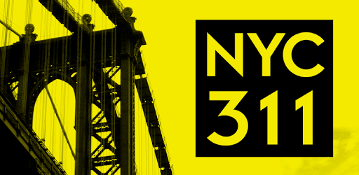

  

We live in one of the most expensive, as well as one of the most diverse, cities in the world. As such, there is going to be a plethora of conflict. We thought it would be an interesting research endeavor to utilize the massive 311 complaint data to see how community needs are met or unmet based on geographical and socioeconomic status within New York City.  

__Motivation__  
Gentrification is a growing problem across NYC and the US, leading to rent increases, the displacement of communities, and community conflict. We wanted to examine the differences in complaint type across the city based on demographics of community district. To do this we used NYC 311 complaint data and American Community Survey (ACS) data from 2013-2017 for community district level information.  

__Related Work__  
New York City has a lot of open source data. We were inspired by the idea of looking at the distribution of health complaints specifically related to NYC Housing Authority (NYCHA), as a large proportion of New Yorkers (1 in 15) live in public housing. However, looking at complaints of just public housing does not give an overview of the whole city, so we expanded our analysis to include the entire city. [Fact Sheet.](https://www1.nyc.gov/assets/nycha/downloads/pdf/NYCHA-Fact-Sheet_2019_08-01.pdf)  

In class, we looked at restaurant reviews and AirBnB rentals in the borough of Manhattan by neighborhood, and we founnd neighborhood level analyses to be interesting. As Manhattan is only one part of New York City, and not even the most populated borough, we decided to look across all five boroughs and compare across the 59 community districts (12 in Manhattan, 12 in the Bronx, 18 in Brooklyn, 14 in Queens, and three in Staten Island).  

__Initial questions:__  
Our initial questions included: what is the distribution of 311 complaints in NYCHA public housing, and what proportion of them are health related compared to the rest of NYC complaints? As we shifted gears and decided to look at NYC by community district instead, our questions became: What neighborhood characteristics predict the volume of complaints, health-related complaints, and unresolved complaints.  

__Data:__  

Data Management
The data used in this project was collected from the [NYC Open Data website](https://data.cityofnewyork.us/Social-Services/311-Service-Requests-from-2010-to-Present/erm2-nwe9).  Web based collection of 311 complaints were made public on 10/18/2011, and contains information from 2010 to present, updated daily.  This data set contains over 22M rows 41 columns that allow us to know the nature, location, and time of the complaint, as well as which department responded to the complaint. Given the size of the data set we used the filtering option on the website to better manage in a couple of ways ways.  First, the data was filter between the years of 2014 and 2018 for each of the five boroughs individually. A sample of 100k from each of these five datasets were imported into R and combined for further analysis.  

American Commmunity Survey data:
We also included aggregated American Commmunity Survey (ACS) data in our analysis. The American Community Survey is conducted annually across the United States by the US Census Bureau to 3.5 million households. ACS provides annual and 5-year estimates of information by graphical region, including NYC Community Districts. We pulled population 5-year estimates (2013-2017) of total population, percent non-Hispanic White, percent non-Hispanic Black, percent Hispanic, and median income of each community district.  

__Exploratory analysis:__  

We created an interactive map visual inspired from P8105 in-class map visualizations using the Airbnb dataset. Our map consisted of New York City 311 data combined with community income data from NYC. The primary objective of this visual was to create a map that displayed 311 complaints in NYC by complaint type. Our dataset (2014-2018) contained over 5000000 data points, which was too many data points to create an interactive map. Therefore, we restricted our sample to complaints created in 2018, and we took a random sample of 10000 of the 2018 data points. These data were grouped and colored by complaint type. The map visual includes an interactive aspect where one can click on each data point to reveal a label for the data point. The label describes the complaint type, location or neighborhood, median income, and status of the complaint (open or closed).  

__Additional analysis:__  

We conducted linear models to examine predictors of number of complaints from 2014-2018 per community district. Our three outcomes were total number of complaints, number of health complaints, and number of unresolved complaints. We looked at these categories of complaints from 2014-2018 predicted by year, and community district level variables including median income (in the 1000s), total population (in the 1000s), percent non-hispanic black and percent Hispanic. For total number of complaints and health complaints we included number of unresolved complaints as a predictor as well.  

__Discussion:__  

Between 2014 and 2018, approximately 22 million 311 complaints were made across the 5 boroughs in NYC. We were interested in how complaints differ by borough and community district. Based on our descriptive figures, mapped data, and linear models of NYC 311 complaint data, we see that there are a few key factors that play into how types of complaints are dispersed across the city.  

With approximately 5000 311 complaints made everyday, a majority of which close within the week (66%), it is interesting to look into where the open complaints remain. We see that in four out of the five boroughs, race has an impact on number of unresolved complaints, where an increase in non-Hispanic Black population predicts an increase in number of unresolved complaints. In Manhattan we see the opposite effect, where an increase in non-Hispanic Black population predicts a decrease in number of unresolved complaints.  

As the income disparity in New York City is one of the greatest in the nation, we wanted to see how median household income of a neighborhood also effected complaints. [https://dailygazette.com/article/2018/07/19/study-finds-n-y-income-disparity-greatest-in-nation]. We found that community districts with higher incomes had different types of complaints than those with lower incomes. By borough we see that in The Bronx, Brooklyn, and Queens, an increase in median income of a community district resulted in a decrease in total health-realted complaints. These areas are less likely to have calls related to water issues, rodents, and hazardous materials including asbestos and lead. What we do see, however, is that areas with higher incomes produce more 311 complaints about the homeless population. It is safe to assume that wealthier areas do not necessarily have more homeless residents, but that a panhandler is seen as more problematic in areas that have a greater density of wealth.  

Ultimately we see that 311 complaints come from all over the city, regardless of community district economic or racial background, and the data is a minefield for answering niche questions about New York City life.  

***

Team Four Members: Jon Brock, Ava Hamilton, Steven Lawrence, Molly Martorella, Stephen Powers  